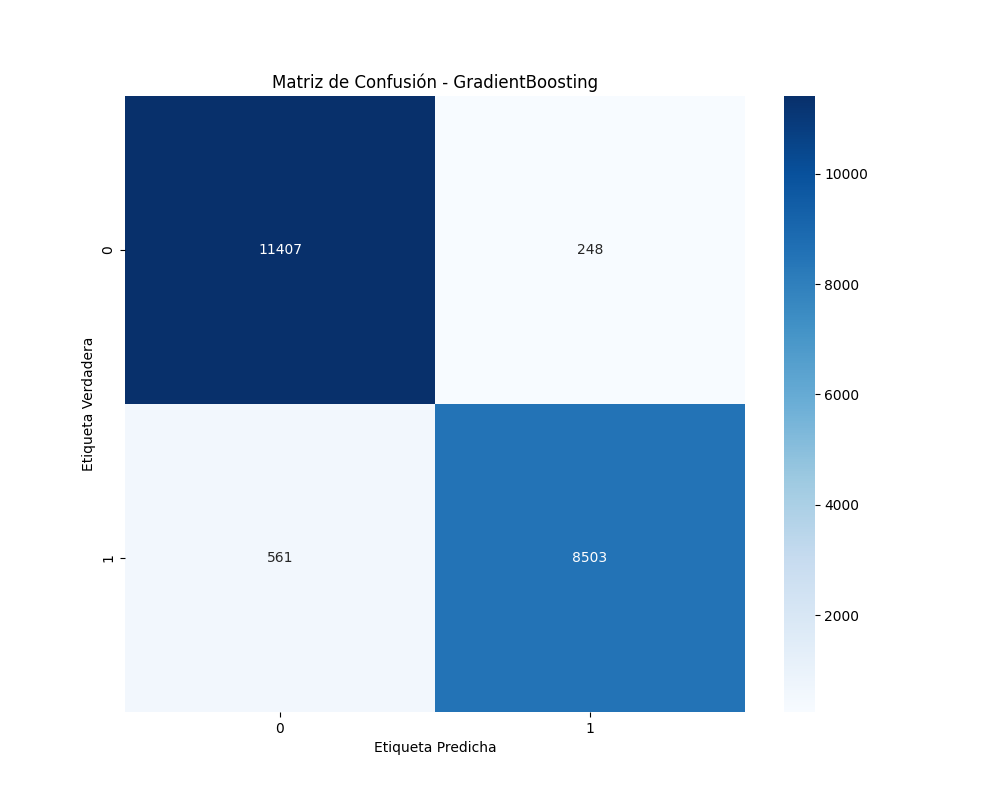
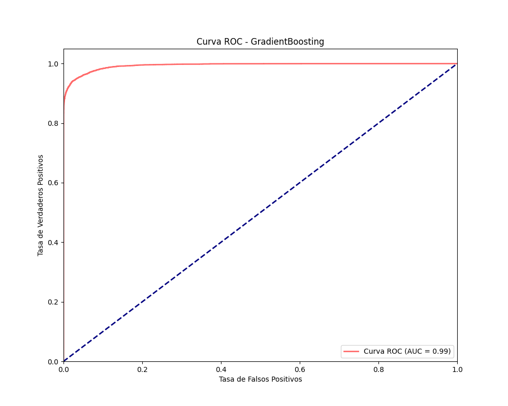
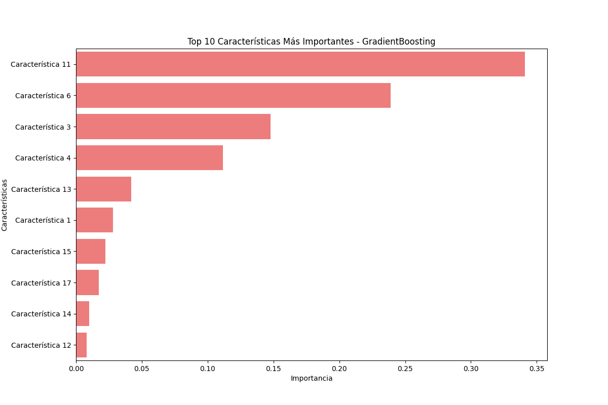

# Informe de Rendimiento Detallado para GradientBoosting

## 1. Métricas de Rendimiento

```
              precision    recall  f1-score   support

           0       0.95      0.98      0.97     11655
           1       0.97      0.94      0.95      9064

    accuracy                           0.96     20719
   macro avg       0.96      0.96      0.96     20719
weighted avg       0.96      0.96      0.96     20719

```

## 2. Matriz de Confusión



Interpretación:
- Verdaderos Positivos: 8503
- Falsos Positivos: 248
- Falsos Negativos: 561
- Verdaderos Negativos: 11407

## 3. Curva ROC



El área bajo la curva ROC (AUC) es 0.9939, lo que indica un rendimiento del modelo excelente.

## 4. Importancia de Características



Las 5 características más importantes son:

```
 Importancia    Característica
    0.340888 Característica 11
    0.238964  Característica 6
    0.147717  Característica 3
    0.111649  Característica 4
    0.041799 Característica 13
```

## 5. Resultados de Validación Cruzada

- Puntuación CV Media: 0.9595
- Desviación Estándar: 0.0007

## 6. Análisis de Sobreajuste

- Precisión en Entrenamiento: 0.9659
- Precisión en Prueba: 0.9610
- Diferencia: 0.0049

## Conclusión

El modelo GradientBoosting muestra un rendimiento general excelente, con un AUC de 0.9939.

No se detecta un sobreajuste significativo.

Las características más importantes para el modelo son ['Característica 11', 'Característica 6', 'Característica 3'], lo que sugiere que estos factores son cruciales para predecir la satisfacción del cliente.

Los resultados de validación cruzada muestran consistencia en el rendimiento del modelo a través de diferentes subconjuntos de datos.
