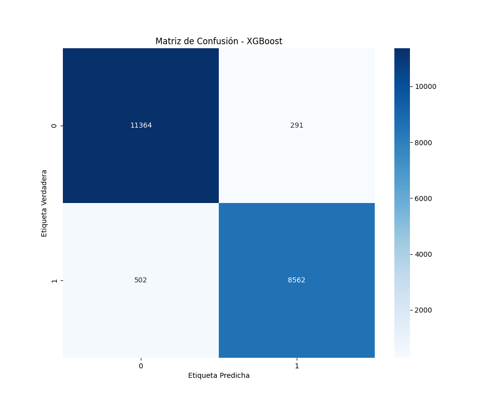
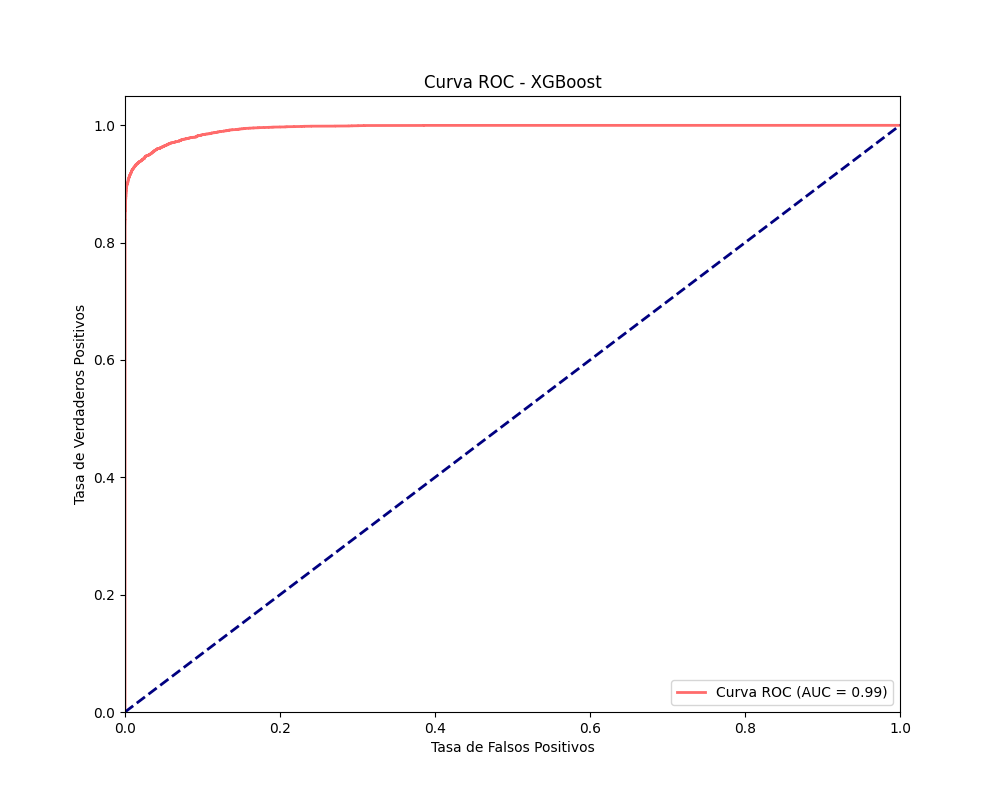
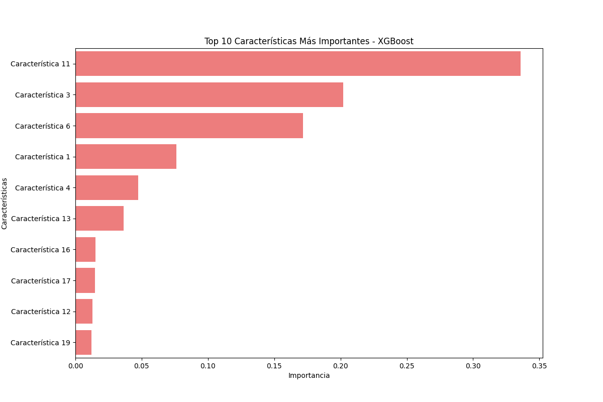

# Informe de Rendimiento Detallado para XGBoost

## 1. Métricas de Rendimiento

```
              precision    recall  f1-score   support

           0       0.96      0.98      0.97     11655
           1       0.97      0.94      0.96      9064

    accuracy                           0.96     20719
   macro avg       0.96      0.96      0.96     20719
weighted avg       0.96      0.96      0.96     20719

```

## 2. Matriz de Confusión



Interpretación:
- Verdaderos Positivos: 8562
- Falsos Positivos: 291
- Falsos Negativos: 502
- Verdaderos Negativos: 11364

## 3. Curva ROC



El área bajo la curva ROC (AUC) es 0.9948, lo que indica un rendimiento del modelo excelente.

## 4. Importancia de Características



Las 5 características más importantes son:

```
 Importancia    Característica
    0.335716 Característica 11
    0.202145  Característica 3
    0.171807  Característica 6
    0.076168  Característica 1
    0.047324  Característica 4
```

## 5. Resultados de Validación Cruzada

- Puntuación CV Media: 0.9595
- Desviación Estándar: 0.0014

## 6. Análisis de Sobreajuste

- Precisión en Entrenamiento: 1.0000
- Precisión en Prueba: 0.9617
- Diferencia: 0.0383

## Conclusión

El modelo XGBoost muestra un rendimiento general excelente, con un AUC de 0.9948.

No se detecta un sobreajuste significativo.

Las características más importantes para el modelo son ['Característica 11', 'Característica 3', 'Característica 6'], lo que sugiere que estos factores son cruciales para predecir la satisfacción del cliente.

Los resultados de validación cruzada muestran consistencia en el rendimiento del modelo a través de diferentes subconjuntos de datos.
